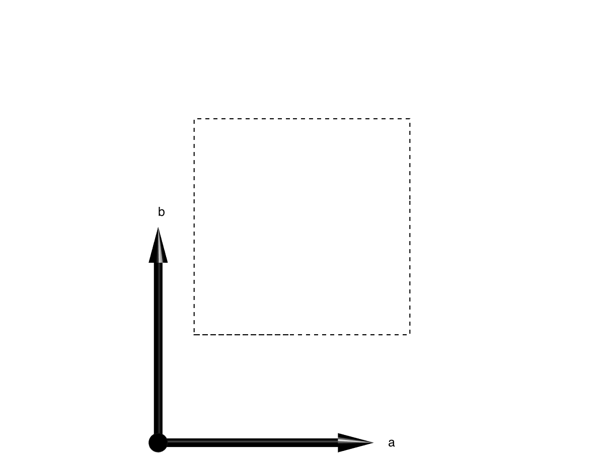

SW Class
===========

To perform calculation using the SpinW library, we need to create an
object (sw class type). It stores all the necessary parameters for the
calculation (crystal structure, interactions, magnetic structure, etc.).
In the object oriented programming dictionary, the data stored in an object,
are called properties. Beside the data, the object also has assigned
functions that perform different computations on the object data. These
functions are called methods and they take the object as first input
argument. To create an sw class object you can simply type::

	model1 = sw

Properties
------------

The output of the previous command shows all the data fields of model1.
Each data field has an initial value and any of them can be modified
directly::

	model1.lattice.lat_const = [3 5 5];

The above command directly modifies the lattice parameters of the
lattice. Modifying propoerties directly is quick and very flexible but
prone to error. The most common mistake is that the new values are not
the same data type as the original ones. For example the field that
stores the lattice space group is integer type::

	class(model1.lattice.sym)

Thus if we want to change it directly, we need an integer number::

	model1.lattice.sym = int32(5);

This will change the crystal space group to 'C 2'. To avoid most common
mistakes, there are several methods (functions) for modifying the above
properties that also perform additional error checking and makes certain
input conversions. For example all lattice related properties can be
modified using the genlattice() function::

	model1.genlattice('lat_const',[3 5 5],'sym','C 2','angled',[90 90 90])

The alternative usage of the above function is the following::

	genlattice(model1,'lat_const',[3 5 5],'sym','C 2','angled',[90 90 90])

This reflects better the input argument structure. The first argument is
the sw object 'model1'. After the first argument comes option name and
value pairs. The first options is 'lat_const' and the value it expects
is a vector with 3 elements if the input vector has different length, the
function throws an error. The second option is 'sym' that also accepts
string input (name of the space group) that is automatically converted to
the index of the space group and stored in model1::

	model1.lattice.sym

The last option is 'angled' that requires a vector with three elements
and defines the alpha, beta, gamma lattice angles in degree. This will be
converted into radian and stored::

	model1.lattice.angle

List of properties
--------------------

The sw object properties store all the information necessary for the spin
wave calculation. There are eight public properties of the sw class each with several subfields:

 * :attr:`sw.lattice`
 * :attr:`sw.unit_cell`
 * :attr:`sw.twin`
 * :attr:`sw.matrix` 
 * :attr:`sw.single_ion`
 * :attr:`sw.coupling`
 * :attr:`sw.mag_str`
 * :attr:`sw.unit`

.. attribute:: sw.lattice

	The **lattice** field stores the lattice parameters and space group information. The subfields are:

	lat_const
		Lattice constants in a row vector with three elements (:math:`a`, :math:`b` and :math:`c`) in |AA| units.

	angle
		:math:`\alpha`, :math:`\beta` and :math:`\gamma` angles in a row vector with three elements in radian units.

	sym
		Crystal space group, single integer (int32 type) that gives the line number in the symmetry.dat file. This file stores the generators of the space group and by default contains the 230 crystallographic space groups with standard settings.

	See also :meth:`sw.genlattice`, :meth:`sw.abc`, :meth:`sw.basisvector`, :meth:`sw.nosym`.

.. attribute:: sw.unit_cell

	The **unit_cell** field stores the information on the atoms in the crystallographic unit cell. Subfields are:

	r
		Atomic positions in lattice units, matrix with dimensions of [3 nAtom], in lattice units.

	S
		Spin (or angular momentum) quantum number of the atoms, row vector with nAtom number of elements. Non-magnetic atoms have :math:`S=0`.

	label
		String label of the atoms in a cell with dimensions of [1 nAtom].

	color
		Color of the atoms for plotting. Stored in a matrix with dimensions of [3 nAtom], every column is an RGB code (int32 numbers between 0-255).

	See also :meth:`sw.addatom`, :meth:`sw.atom`, :meth:`sw.matom`, :meth:`sw.newcell`.

.. attribute:: sw.twin
	
	The **twin** field stores information on crystallographic twins. The subfields are:

	rotc
		Rotation matrices in the xyz coordinate system for every twin, stored in a matrix with dimensions of [3 3 nTwin].

	vol
		Relative volume of the twins, stored in a row vector with nTwin elements.

	See also :meth:`sw.addtwin`, :meth:`sw.twinq`, :meth:`sw.ntwin`.

.. attribute:: sw.matrix

	The **matrix** field stores 3x3 matrices that can be referenced in the magnetic Hailtonian. The subfields are:

	mat
		It stores the actual values of 3x3 matrices stacked along the third dimension with dimensions of [3 3 nMat].

	color
		RGB color codes assigned for every matrix, stored in a matrix with dimensions of [3 nMatrix], each column is an [R;G;B] code with int32 numbers between 0 and 255.

	label
		Label for every matrix, stored as strings in a cell with dimensions of [1 nCell].

	See also :meth:`sw.addmatrix`, :meth:`sw.getmatrix`, :meth:`sw.setmatrix`.

.. attribute:: sw.single_ion

	The **single_ion** field stores the single ion expression of the Hamiltonian. The subfields are:

	aniso
		Row vector contains nMagAtom integers, each integer assignes one of the matrices from the :attr:`sw.matrix` field to a magnetic atom in the :meth:`sw.matom` list as a single ion anisotropy. Zero means no assigned anisotropy matrix.

	g
		Row vector of nMagAtom integers, each integer assignes one of the matrices from the :attr:`sw.matrix` field to a magnetic atom in the :meth:`sw.matom` list as a g-tensor.

	field
		External magnetic field stored in a row vector with the 3 components in the xyz coordinate system, default unit is Tesla.

	T
		Temperature, scalar, default unit is Kelvin.

	See also :meth:`sw.addaniso`, :meth:`sw.addg`, :meth:`sw.getmatrix`, :meth:`sw.setmatrix`, :meth:`sw.intmatrix`, :meth:`sw.field`.

.. attribute:: sw.coupling

	The **coupling** field stores the list of bonds. Where each bond is defined between two magnetic atom. Each bond has a direction, it points from atom 1 to atom 2. In the subfiels every column defines a bond, the subfields are:

	dl
		Translation vector between the unit cells of the two interacting spins, stored in a matrix of integer numbers with dimensions of [3 nCoupling].

	atom1
		Stores the index of atom 1 for every bond pointing to the list of magnetic atoms in :meth:`sw.matom` list, stored in a row vector with nCoupling elements.

	atom2
		Index of atom 2 for each bond.

	mat_idx
		Integer indices selecting  exchange matrices from :attr:`sw.matrix` field for every bond, stored in a matrix with dimensions of [3 nCoupling]. Maximum three matrices per bond can be assigned (zeros for no coupling).

	idx
		An integer index for every bond, an increasing number with bond length. Symmetry equivalent bonds have the same index.

	See also :meth:`sw.gencoupling`, :meth:`sw.addcoupling`.

.. attribute:: sw.mag_str

	The **mag_str** field stores the magnetic structure. It can store single-Q structures or multi-Q structures on a magnetic supercell. Strictly speaking it stores the expectation value of the spin of each magnetic atom. The magnetic moment directions are given by :math:`g_i\cdot \langle S_i\rangle`. The subfields are:

	S
		It stores the spin directions for every magnetic atom either in the crystallographic unit cell or in a magnetic supercell in a matrix with dimensions of [3 nMagExt]. Every column stores :math:`\langle S_x\rangle, \langle S_y\rangle, \langle S_z\rangle` spin components in the xyz coordinate system. The number of spins in the supercell is::

			nMagExt = nMagAtom*prod(mag_str.N_ext);

	k
		Magnetic ordering wave vector stored in a row vector with 3 components in reciprocal lattice units. Default value is [0 0 0].

	n
		Normal vector to the rotation of the moments in case of non-zero ordering wave vector (single-Q magnetic structures), row vector with three elements. The components are in the xyz coordinate system. Default value is [0 0 1].

	N_ext
		Dimensions of the magnetic supercell in lattice units stored in a row vector with three elements. Default value is [1 1 1] if the magnetic cell is identical to the crystallographic cell. The three elements extends the cell along the :math:`a, b, c` axes.

	See also :meth:`sw.genmagstr`, :meth:`sw.optmagstr`, :meth:`sw.anneal`, :meth:`sw.nmagext`, :meth:`sw.structfact`, :meth:`sw.optmagsteep`.

.. attribute:: sw.unit

	The **unit** field stores the conversion factors between energy, magnetic field and temeprature units in the Hamiltonian. Defaults units are meV, Tesla and Kelvin for energy, magnetic field and temperature respectively. To use identical units for energy, magnetic field and temperature use 1 for each subfields. The subfields are:

	kB
		Boltzmann constant, default value is 0.0862 meV/K.

	muB
		Bohr magneton, default value is 0.0579 meV/T.

Methods
----------

In line with the above example the general argument structure of the
method functions is one of the following::

	function(obj,'Option1',Value1,'Option2',Value2,...)
	function(obj,Value1,Value2,...)

The first type of argument list is used for functions that require
variable number of input parameters with default values. The second type
of argument structure is used for functions that require maximum up to
three fixed input parameter. Every method has help that can be called by
one of the following methods:

 * selecting the function name in the Editor/Command Window and pressing F1 
 * in the Command Window typing for example::

	help sw.genlattice

This shows the help of the genlattice() function in the Command Window.
To open the help in a separate window you need to write::

	doc sw.genlattice

To unambiguously identify the functions it is usefull to refer them as
sw.function() this way matlab knows which function to select from several
that has the same name. For example the plot() funcion is also defined
for the sw class. However by writing::

	help plot

we get the help for the standard Matlab plot function. To get what we
want use::

	help sw.plot

By the way this function is one of the most usefull ones. It can show
effectively all information stored in the sw object by plotting crystal
structure, couplings, magnetic structure etc. Calling it on an empty
object shows only the unit cell::

	plot(model1)

	*Plot of empty sw object.*

As you might noticed, there is an alternative calling of any method
function: obj.function(...), this is just equivalent to the previous
argument structures.

Copy
------------

The sw class belong to the so called handle class. It means in short that
the model1 variable is just a pointer to the memory where the class is
stored. Thus by doing the following::

	model2 = model1;

will only duplicate the pointer but not the values stored in the sw object. Thus if I change something in model1, model2 will change as well. To clone the object (the equivalent of the usual '=' operation in Matlab) the :meth:`sw.copy` function is necessary::

	model2 = copy(model1);

.. |AA|   unicode:: U+212B .. Angstrom sign